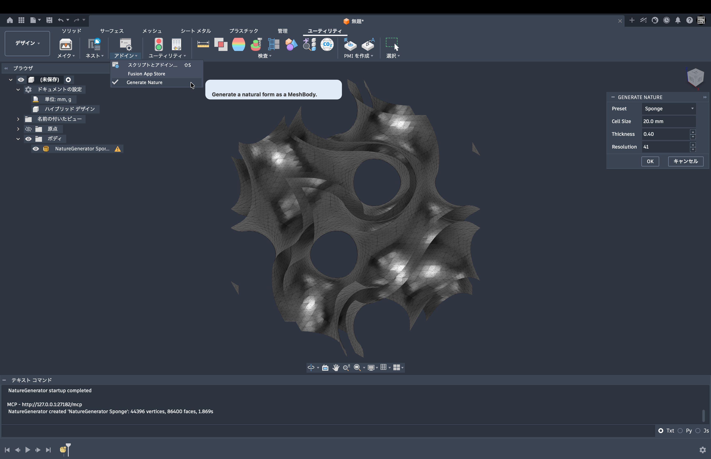

# NatureGenerator

> Generate manufacturable natural forms directly inside Autodesk Fusion.

NatureGenerator v0.5.0 is the stable interactive Fusion baseline with the
Sponge preset. Sprint 9 development adds deterministic Rock generation and a
preset-driven Fusion dialog alongside the executable Sponge and Coral forms.



**Stable baseline:**
[v0.5.0 — Interactive Generation Command](docs/V0.5.0_BASELINE.md)

[Release history](docs/RELEASES.md) · [Roadmap](ROADMAP.md) ·
[Architecture](ARCHITECTURE.md) · [Documentation index](docs/README.md)

The project includes a Fusion-independent procedural geometry pipeline and a
user-facing nature preset framework. Sponge is backed by the configurable
gyroid scalar field, Coral uses a closed branching implicit solid, and Rock
uses a deformed ellipsoid with dependency-free value noise.

## Geometry pipeline

```text
Nature Preset
    -> Generator Runtime
    -> Scalar Field
    -> Voxel Grid
    -> Marching Tetrahedra
    -> Triangle Mesh
        -> STL Export
        -> Fusion Adapter
            -> Fusion MeshBody
```

Geometry calculations live in `core/` and `generators/` and remain usable
without Autodesk Fusion 360. Functional Autodesk API integration belongs in
`fusion/`; the add-in entry point uses `adsk` only to report fatal startup and
shutdown diagnostics. Command orchestration delegates to the adapter boundary.

## Repository layout

- `NatureGenerator.py`: Fusion 360 add-in entry point.
- `NatureGenerator.manifest`: add-in metadata.
- `commands/`: command definitions and UI coordination.
- `core/`: Fusion-independent geometry primitives, sampled grids, meshes, and
  STL serialization.
- `generators/`: procedural form generation algorithms.
- `presets/`: user-facing natural-form definitions and availability metadata.
- `fusion/`: adapters between core meshes and Fusion 360.
- `examples/`: small usage examples.
- `tests/`: dependency-free automated tests.
- `resources/`: icons and other add-in assets.

## Development

NatureGenerator currently requires no third-party Python packages. Run the
foundation tests from the repository root with:

```bash
PYTHONPATH=NatureGenerator python3 -m unittest discover -s NatureGenerator/tests
```

For Fusion 360 installation and contribution guidance, see
[`CONTRIBUTING.md`](CONTRIBUTING.md). The planned milestones are documented in
[`ROADMAP.md`](ROADMAP.md).

## Nature presets

Commands and future UI code select a `NaturePreset` instead of importing or
naming mathematical algorithm classes. A preset contains immutable presentation
metadata, parameter defaults, a stable generator ID, and an explicit availability
status. It never samples a field or extracts a mesh.

```python
from presets import PresetFactory

for preset in PresetFactory.list_all():
    print(preset.display_name, preset.available)

sponge = PresetFactory.get("sponge")
```

Built-ins are registered explicitly for predictable Fusion behavior; the
framework does not scan directories or dynamically import arbitrary files.

| Preset | Category | Generator ID | Status |
| --- | --- | --- | --- |
| Coral | Aquatic | `coral` | Available in Sprint 8 development |
| Sponge | Aquatic | `gyroid` | Available |
| Bone | Biological | `cellular` | Unavailable — generator not implemented |
| Bark | Botanical | `noise` | Unavailable — generator not implemented |
| Rock | Geological | `rock` | Available in Sprint 9 development |

## Generator runtime

`GeneratorFactory` is the execution boundary between user-facing presets and
algorithm implementations. It resolves an available preset's stable
`generator_id` through an explicit registry and returns a fresh `Generator`.
There is no filesystem discovery or algorithm selection chain.

```python
from generators import GenerationRequest, GeneratorFactory

request = GenerationRequest(
    preset_id="sponge",
    parameter_overrides={"cell_size": 12.0, "thickness": 0.25},
    resolution=21,
)
result = GeneratorFactory.generate_request(request)

print(result.statistics.face_count)
print(result.elapsed_time)
print(result.warnings)
```

`GyroidGenerator` constructs `GyroidField`, samples a `VoxelGrid`,
extracts a `TriangleMesh` with marching tetrahedra, validates it, and returns an
immutable `GeneratorResult`. The finite gyroid crop normally has boundary edges,
so that expected open-mesh condition is returned as a warning rather than being
misrepresented as watertight.

`CoralGenerator` uses the same Geometry Core to extract a connected union of
branch capsules. Its surface stays inside the sampled domain and must pass
watertight validation. `GeneratorFactory.create_for_preset(preset_id)` resolves
both forms through explicit preset and generator registration. The
request-oriented `SpongeGenerator`, `CoralGenerator`, and `RockGenerator` each return a
`TriangleMesh`; the factory preserves the public immutable `GeneratorResult`
API and delegates Sponge geometry to the unchanged `GyroidGenerator` pipeline.

`GeneratorFactory.generate(preset, parameters)` remains available for existing
callers and uses the original resolution of 17 samples per axis.

## Interactive Fusion generation

The **Generate Nature** command appears in the Design workspace's Add-Ins panel.
Its dialog selects Sponge, Coral, or Rock and builds each form's inputs from
immutable preset parameter metadata before it
runs the Generator Runtime and inserts the resulting `TriangleMesh` as a
`MeshBody` in the active design.

```text
Generate Nature
    -> GenerationRequest
    -> PresetFactory
    -> GeneratorFactory
    -> TriangleMesh
    -> Fusion Adapter
    -> MeshBody
```

The dialog exposes each preset's metadata-defined inputs:

- **Cell Size:** physical form scale; the gyroid period for Sponge and overall
  branching scale for Coral.
- **Thickness:** gyroid field-value offset for Sponge and relative branch radius
  for Coral.
- **Resolution:** samples per axis; higher values increase mesh quality and
  pure-Python runtime cost. The supported range is 9–41 and the default is 17.
- **Rock Size, Roughness, and Seed:** physical scale, bounded surface variation,
  and a repeatable deterministic variation key.

Sponge, Coral, and Rock are executable on the Sprint 9 branch. Other natural forms
appear as Coming Soon and produce no geometry when selected. Cancel also creates
no geometry. Command orchestration remains Fusion-independent; Autodesk command
inputs, event handling, and `MeshBody` construction are isolated in `fusion/`.
See [`docs/SPRINT8_DESIGN.md`](docs/SPRINT8_DESIGN.md) for the multi-generator
contract and the successful macOS Autodesk Fusion acceptance result. The
observed Coral run created `NatureGenerator Coral` with 820 vertices and 1,636
faces in approximately 0.148 seconds; this is one verified configuration rather
than an exhaustive parameter test.
See [`docs/SPRINT9_DESIGN.md`](docs/SPRINT9_DESIGN.md) for Rock's field,
sampling-margin, and preset-driven UI decisions.

## Gyroid scalar field

`GyroidField` evaluates the dimensionless gyroid function after mapping one
world-space `cell_size` to a full `2π` period:

```text
g(x, y, z) = sin(x)cos(y) + sin(y)cos(z) + sin(z)cos(x)
field(x, y, z) = abs(g(x, y, z)) - thickness
```

Negative field values are inside the gyroid sheet band, zero values describe its
two boundaries, and positive values are outside. `thickness` is a field-value
half-band rather than a world-space distance.

```python
from generators.gyroid import GyroidField
from generators.visualization import render_ascii_slice

field = GyroidField(cell_size=10.0, thickness=0.2)
value = field.sample(1.0, 2.0, 3.0)

preview = render_ascii_slice(
    field,
    (-10.0, 10.0),
    (-10.0, 10.0),
    z=0.0,
)
print(preview)
```

The preview helper samples text only; it does not create triangles or meshes.

## Marching tetrahedra

The dependency-free extractor accepts a sampled `VoxelGrid` and returns an
indexed `TriangleMesh`:

```python
from core.marching_tetrahedra import extract_isosurface
from core.voxel_grid import VoxelGrid

grid = VoxelGrid.sample(field, (-10, -10, -10), (10, 10, 10), (32, 32, 32))
mesh = extract_isosurface(grid, iso_value=0.0)
print(mesh.statistics())
```

It interpolates edge crossings, shares vertices across cached grid edges,
orients normals toward increasing field values, and uses a consistent six-part
tetrahedral decomposition. A closed isosurface whose exterior fits inside the
sampling bounds should be watertight; surfaces touching the bounds remain open.

Run the simple benchmark with:

```bash
PYTHONPATH=NatureGenerator python3 NatureGenerator/examples/benchmark_marching_tetrahedra.py
```

## Mesh processing and export

`MeshBuilder` incrementally creates indexed meshes while welding exact or
tolerance-close vertices. `optimize_mesh()` conservatively welds duplicates and
removes duplicate triangles, degenerate faces, and unused vertices; it does not
decimate or smooth geometry.

`MeshValidator` reports boundary edges, nonmanifold edges and vertex fans,
inconsistent winding, degenerate and duplicate faces, unused vertices, and
connected components.
`TriangleMesh.statistics()` also supplies surface area, signed volume, bounds,
and watertight/manifold status.

Meshes can be written as binary or ASCII STL, Wavefront OBJ, or ASCII PLY:

```python
from core.mesh_optimizer import optimize_mesh
from core.mesh_validator import MeshValidator
from core.obj_writer import write_obj
from core.ply_writer import write_ply
from core.stl_writer import write_binary

mesh = optimize_mesh(mesh, weld_tolerance=1e-9)
report = MeshValidator(require_watertight=True).validate(mesh)
if not report.valid:
    raise ValueError(report.issues)

write_binary(mesh, "form.stl")
write_obj(mesh, "form.obj")
write_ply(mesh, "form.ply")
```

## Development Workflow

NatureGenerator uses a review-driven workflow that separates product direction,
architecture, implementation, and release decisions:

```text
Plan
  |
  v
Architecture Review (ChatGPT)
  |
  v
Implementation (Codex)
  |
  v
Code and Design Review (ChatGPT)
  |
  v
Commit
  |
  v
Draft Pull Request
  |
  v
Final Review
  |
  v
Merge to main
  |
  v
Version Tag
```

### Roles

- **Product Owner:** Defines goals, priorities, user value, and approves major
  direction.
- **ChatGPT:** Helps define architecture, Sprint scope, APIs, and review criteria,
  then reviews the implementation and documentation.
- **Codex:** Inspects the repository, implements changes, runs tests, prepares
  commits, and creates draft pull requests.

### Sprint Definition of Done

- Sprint goal and exclusions are documented.
- Architecture impact is reviewed.
- Implementation is complete.
- The full test suite passes.
- Compilation and `git diff --check` pass.
- Documentation is updated.
- No unintended dependencies or generated artifacts are added.
- The draft pull request is reviewed.
- Changes are merged to `main`.
- A version tag is created for a meaningful milestone.

### Branch and release conventions

- Create feature branches from the latest `main`.
- Use descriptive names such as `feature/generator-runtime`,
  `feature/fusion-adapter`, and `feature/fusion-command`.
- Never implement directly on `main`.
- Use draft pull requests during development.
- Use annotated semantic-version tags such as `v0.1.0`, `v0.2.0`, and `v0.3.0`.
- Only tag merged commits on `main`.
- Do not tag every small documentation or maintenance change; reserve tags for
  meaningful milestones.
